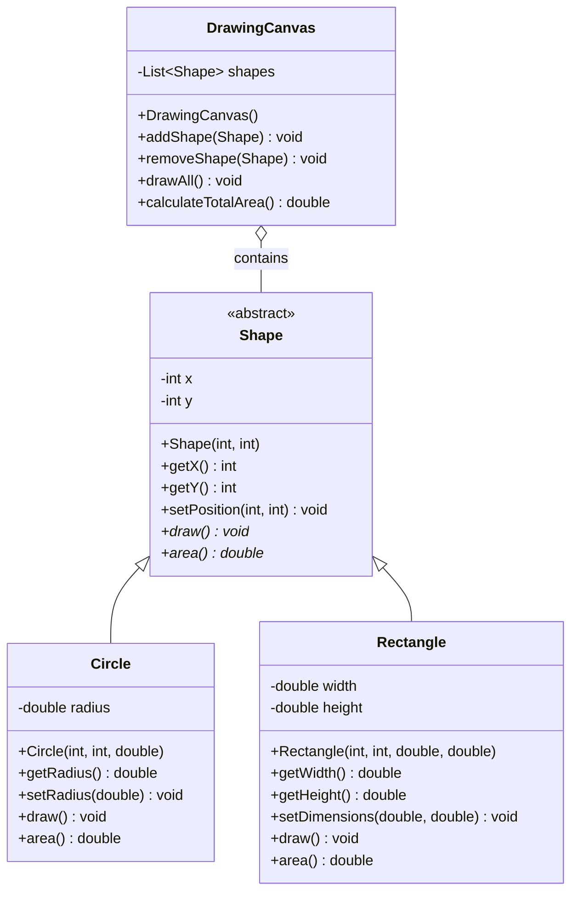

# Coure Project 1: Java class diagram generator

This is a repository for a project about a Java-based tool for scanning vanilla Java code and visualizing class structures through Mermaid diagrams.

## Overview

Cerebro is a powerful Java application designed to scan vanilla Java code files, analyze their structure using the JavaCompiler API, and generate visual class diagrams using Mermaid. The tool enables users to select specific files for inclusion through a command-line interface or configuration file.

## Educational Purpose

This group project is designed to help students gain practical experience with several important Java concepts:

- **File I/O Operations**: Reading and analyzing Java source files
- **Multithreading**: Implementing parallel file processing for enhanced performance
- **JVM Understanding**: Working with the Java Virtual Machine's compilation process
- **JavaCompiler API**: Using the javax.tools.JavaCompiler API to analyze source code and generate abstract syntax trees

## Features

- Scan and analyze vanilla Java code files using the JavaCompiler API
- Select specific files for diagram generation via CLI or configuration file
- Generate comprehensive class diagrams using Mermaid syntax that showcase:
  - Class hierarchies and relationships
  - Fields and their visibility modifiers
  - Methods and their signatures
  - Inheritance and implementation relationships
  - Association, aggregation, and composition relationships

## Getting Started

### Prerequisites

- Java Development Kit (JDK) 17 or higher
- Maven or Gradle for dependency management
- Git for version control

### How to Start

1. **Fork the Repository**
   - Visit [https://github.com/codefodvn/course-project-1](https://github.com/codefodvn/course-project-1)
   - Click the "Fork" button in the upper right corner to create a copy in your GitHub account

2. **Clone Your Forked Repository**
   ```bash
   # Clone your forked repository
   git clone https://github.com/YOUR-USERNAME/course-project-1.git

   # Navigate to the project directory
   cd course-project-1
   ```

3. **Create a Feature Branch**
   ```bash
   # Create a new branch for your feature or task
   git checkout -b feature/your-feature-name
   ```

4. **Build and Run the Project**
   ```bash
   # Build the project
   mvn clean install
   
   # Run using the JAR file
   java -jar target/cerebro.jar --scan-path=/path/to/java/project
   ```

5. **Commit and Push Changes**
   ```bash
   # Add your changes
   git add .
   
   # Commit with a descriptive message
   git commit -m "Add feature: brief description of your changes"
   
   # Push to your forked repository
   git push origin feature/your-feature-name
   ```

### Recommended user interface

#### Using the Command Line Interface

```bash
# Basic usage
java -jar cerebro.jar --scan-path=/path/to/java/project

# Generate a class diagram with specific files
java -jar cerebro.jar --scan-path=/path/to/java/project --include=Model.java,Service.java

# Specify output file
java -jar cerebro.jar --scan-path=/path/to/java/project --output=class-diagram.md
```

#### Using a Configuration File

Create a `cerebro-config.json` file:

```json
{
  "scanPath": "/path/to/java/project",
  "includeFiles": [
    "Model.java",
    "Service.java",
    "Utils.java"
  ],
  "outputPath": "./diagrams/class-diagram.md",
  "threadCount": 4,
  "showPrivateMembers": true,
  "showFieldTypes": true,
  "includeMethodParameters": true
}
```

Then run:

```bash
java -jar cerebro.jar --config=cerebro-config.json
```

## Recommended project structure

```
cerebro/
├── src/
│   ├── main/
│   │   ├── java/
│   │   │   └── com/
│   │   │       └── cerebro/
│   │   │           ├── Main.java
│   │   │           ├── scanner/
│   │   │           │   ├── FileScanner.java
│   │   │           │   └── JavaParser.java
│   │   │           ├── model/
│   │   │           │   ├── JavaClass.java
│   │   │           │   ├── JavaMethod.java
│   │   │           │   └── Relationship.java
│   │   │           ├── diagram/
│   │   │           │   ├── DiagramGenerator.java
│   │   │           │   └── ClassDiagramGenerator.java
│   │   │           └── util/
│   │   │               ├── ConfigurationManager.java
│   │   │               ├── CompilerHelper.java
│   │   │               └── ASTVisitor.java
│   │   └── resources/
│   │       └── log4j2.xml
│   └── test/
│       └── java/
│           └── com/
│               └── cerebro/
│                   ├── scanner/
│                   ├── diagram/
│                   └── util/
├── pom.xml
├── README.md
├── LICENSE
└── .gitignore
```

## Core Components

### File Scanner

The file scanner component recursively traverses the specified directory, identifies Java source files, and prepares them for compilation and analysis. It utilizes multithreading to efficiently process multiple files in parallel.

### JavaCompiler API Integration

Leverages the javax.tools.JavaCompiler API to:
- Compile Java source files in-memory
- Generate and access the Abstract Syntax Tree (AST)
- Extract precise type information and relationships
- Analyze class structure, field types, and method signatures

### AST Visitor

The AST visitor navigates the compiler-generated syntax tree to:
- Identify class declarations and their relationships
- Extract field declarations with types and modifiers
- Collect method signatures with parameter and return types
- Determine inheritance hierarchies and interface implementations

### Diagram Generator

The diagram generator creates Mermaid syntax representations for class diagrams:
- Shows classes with proper relationships (inheritance, implementation)
- Represents fields with visibility modifiers and types
- Displays methods with parameters and return types
- Visualizes associations between classes based on field types

## Example Output

### Class Diagram



## Group Assignment Tasks

1. **Setup and Basic Structure**
   - Set up the project structure and version control
   - Implement the command-line interface and configuration file parser
   - Create the basic file scanning functionality

2. **JavaCompiler API Integration**
   - Set up the JavaCompiler API
   - Implement in-memory compilation of Java source files
   - Create the AST visitor patterns for analyzing compiled code
   - Develop the type resolution system for identifying relationships

3. **Class Diagram Generation**
   - Build the class structure model from the AST analysis
   - Implement relationship detection (inheritance, implementation, association)
   - Create the Mermaid diagram syntax generator
   - Implement formatting and styling options

4. **Multithreading and Performance**
   - Implement parallel file processing
   - Optimize the compilation and analysis process
   - Add progress tracking and reporting

5. **Testing and Documentation**
   - Write unit tests for all core components
   - Create integration tests with sample Java projects
   - Document the codebase and prepare usage examples

## Acknowledgments

- This project was created as a group assignment to demonstrate proficiency in Java programming concepts
- Mermaid.js for the diagram syntax and rendering capabilities
